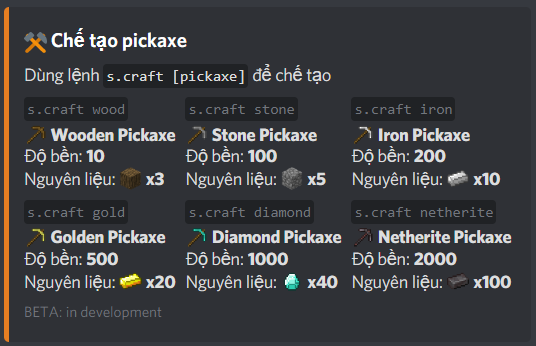
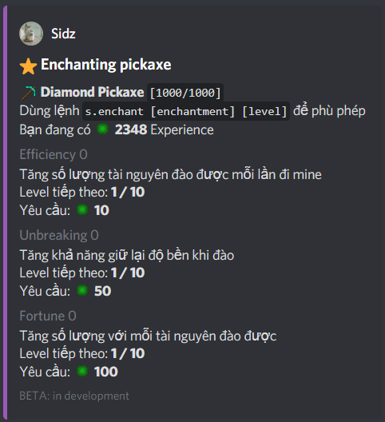
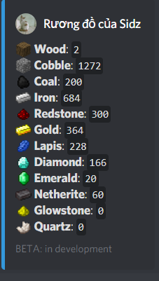
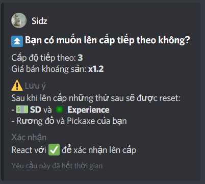

# Sidz-BOT
**Discord bot để chơi game đào mỏ, bán khoảng sản và đua top!**

## Hình ảnh

## Cách chơi
* Đầu tiên, bạn hãy đào tài nguyên bằng lệnh **s.mine**
* Sau khi có đủ nguyên liệu, bạn có thể chế tạo pickaxe mới bằng lệnh **s.craft**
* Để nâng cấp cho pickaxe của bạn, hãy phù phép bằng lệnh **s.enchant**
* Pickaxe của bạn có một độ bền nhất định. Bạn có thể sửa pickaxe của mình bằng lệnh **s.fix**
* Để xem rương đồ của bạn, hãy dùng lệnh **s.inventory**
* Để bán khoáng sản kiếm tiền, hãy dùng lệnh **s.sell**
* Để xem số tiền mà bạn đang có, hãy dùng lệnh **s.money**
* Tham gia đua top! Xem bảng xếp hạng bằng lệnh **s.top**
* Kiếm tra rank của bạn bằng lệnh s.rank và lên rank bằng lệnh **s.rankup**
* Sau khi đạt rank Z, bạn có thể lên cấp để tăng giá bán khoáng sản của mình bằng lệnh **s.prestige**
* Để xem thông tin về tài khoản của bạn, hãy dùng lệnh **s.me**
* Để biết thêm về tất cả các câu lệnh, cũng như những chức năng khác, hãy dùng lệnh **s.help**

## Cách tự host Sidz Bot
* Cài NodeJS, tải Sidz Bot và chạy `npm install` để cài các dependency
* Tạo Bot Discord và lấy token
* Config token đã lấy và các thông tin khác trong [config.json](config.json)
* Tạo MySQL Database và import [Dump](SidzBotDump.sql)
* Config thông tin MySQL trong [mysql.js](mysql.js)
* Config các icon trong [resources.json](mining/resources.json) [pickaxes.json](mining/pickaxes.json) [currency.json](mining/currency.json) 
